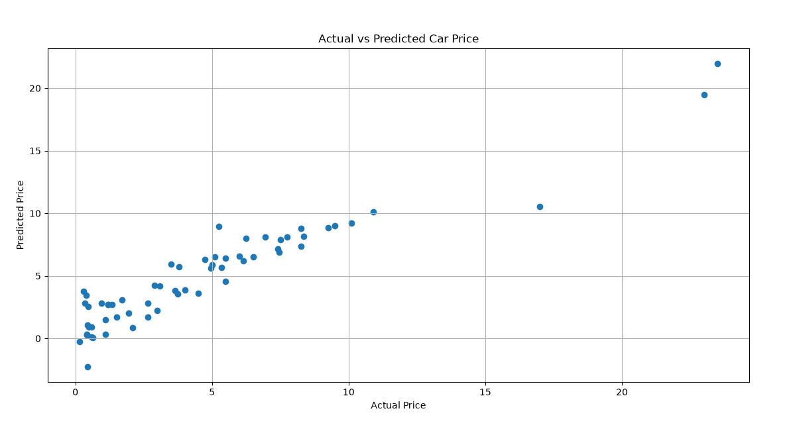
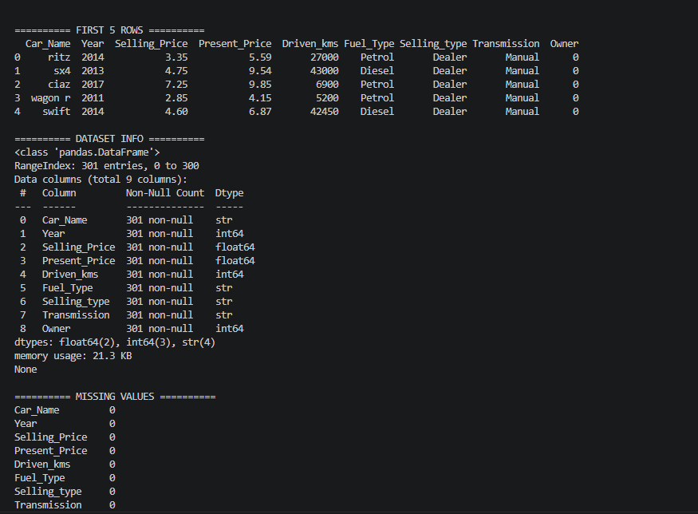
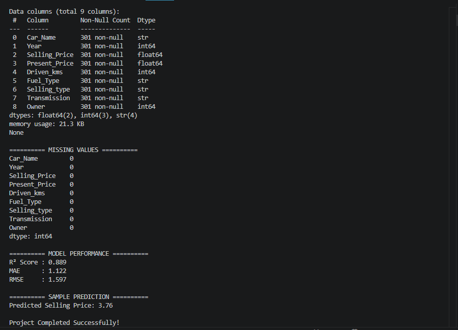

# 🚗 Car Price Prediction using Machine Learning

## 📌 Project Description

This project was developed as part of the **CodeAlpha Data Science Internship**.

The objective of this project is to predict the price of a car based on various features such as company, model, year, fuel type, kilometers driven, and other relevant attributes. A **Linear Regression** model is used to learn the relationship between these features and the car's selling price.

---

# 🎯 Objectives

- Load and understand the car dataset.
- Perform data preprocessing.
- Handle categorical and numerical data.
- Train a Linear Regression model.
- Predict car prices.
- Evaluate the model's performance.

---

# 📂 Dataset

**Dataset Used:** `car data.csv`

### Dataset Features

- Car Name
- Year
- Selling Price
- Present Price
- Kms Driven
- Fuel Type
- Seller Type
- Transmission
- Owner

---

# 🛠 Technologies Used

- Python
- Pandas
- NumPy
- Matplotlib
- Scikit-learn

---

# 🤖 Machine Learning Algorithm

## Linear Regression

Linear Regression is a supervised machine learning algorithm used to predict continuous numerical values.

In this project, it predicts the **selling price of a car** based on its features.

---

# 📊 Project Workflow

1. Import required libraries.
2. Load the dataset.
3. Explore and preprocess the data.
4. Encode categorical variables.
5. Split the dataset into training and testing sets.
6. Train the Linear Regression model.
7. Predict car prices.
8. Evaluate the model.
9. Visualize Actual vs Predicted Prices.

---

# 📈 Model Evaluation

The model is evaluated using:

- R² Score
- Mean Absolute Error (MAE)
- Mean Squared Error (MSE)
- Root Mean Squared Error (RMSE)

---

# 🚀 Features

- Data Loading
- Data Preprocessing
- Feature Encoding
- Model Training
- Car Price Prediction
- Model Evaluation
- Data Visualization

---

# 📋 Requirements

```
pandas
numpy
matplotlib
scikit-learn
```

---

# ▶️ How to Run

### Clone the repository

```bash
git clone https://github.com/bolluvarshitha142-bit/code_alpha_car_price_prediction.git
```

### Move to the project folder

```bash
cd code_alpha_car_price_prediction
```

### Install dependencies

```bash
pip install -r requirements.txt
```

### Run the project

```bash
python carpriceprediction.py
```

---

# 📸 Project Screenshots

## Car Price Prediction Graph



---

## Program Output





---

# 📌 Project Outcome

This project demonstrates how Machine Learning can be used to estimate car prices based on different vehicle features. It covers the complete machine learning pipeline from data preprocessing and model training to prediction and evaluation.

---

# 👩‍💻 About the Author

**Name:** Bollu Varshitha

**Degree:** B.Tech in Computer Science and Engineering (AI & ML)

**Role:** CodeAlpha Data Science Intern

**GitHub:** https://github.com/bolluvarshitha142-bit

Passionate about Machine Learning, Data Science, and Artificial Intelligence. Interested in building real-world projects and continuously improving programming and problem-solving skills.
